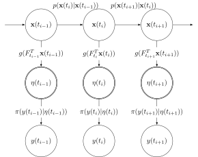
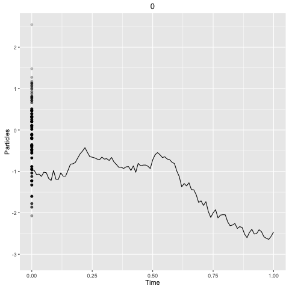

  
  ```{r setup, include=FALSE}
packages <- c("dplyr", "tidyr", "ggplot2", "gridExtra", "magrittr", "shiny",
              "scales", "ggfortify", "leaflet", "readr")
newPackages <- packages[!(packages %in% as.character(installed.packages()[,"Package"]))]
if(length(newPackages)) install.packages(newPackages)
lapply(packages,require,character.only=T)

theme_set(theme_minimal())

## Connect to the urban observatory database
# my_db = src_postgres(dbname = "uodata_2", host = "uodata1", port = "5432", user = "uo_select")
```

## Urban Observatory Air Quality Data

```{r map, echo=FALSE, message=FALSE, fig.align='center'}
## Get the sensor locations
# query = paste0(readLines("Scripts/GetSensorLocations.SQL"), collapse = " ")
# locations = tbl(my_db, sql(query)) %>% collect()
# write.csv(locations, file = "locations.csv", row.names = FALSE)

locations = read_csv("locations.csv")

## Output a leaflet map of sensor locations
## Remove misspecified sensor locations (with lat & lon = 0.0)
leaflet(locations %>% filter(latitude != 0.0)) %>%
  addTiles() %>%
  addMarkers(~longitude, ~latitude, popup = ~ paste(name, reading, sep = "\n"))
```

## Urban Observatory Readings

```{r ts_plot, cache=TRUE, echo=FALSE, message=FALSE, fig.align="center"}
# Set parameters for data
readings = c("Temperature", "NO2", "CO", "NO", "Humidity")
name = "new_new_emote_1102"
startDate = Sys.Date() - 2
endDate = Sys.Date()

# tbl(my_db, sql("SELECT * FROM sensor_data_formatted")) %>%
# filter(sensor_name == name & timestamp >= startDate & timestamp <= endDate & reading %in% readings) %>%
# write.csv("sensor_data.csv", row.names = FALSE)

data = read_csv("sensor_data.csv")

# Plot the readings
data %>%
  collect() %>%
  mutate(numeric_value = as.numeric(value)) %>%
  ggplot(aes(x = timestamp, y = numeric_value, colour = reading)) +
  geom_line() +
  ggtitle(paste0(paste0(readings, collapse = ", "), " readings at\n sensor ", name)) +
  ylab("reading") +
  theme(legend.position = "none") +
  facet_wrap(~reading, ncol = 1, scales = "free_y")
```

## Bayesian Parametric Inference

* Given data, $y$, we want to fit a model with parameters $\theta$
  
  * Bayes theorem allows us to do this

$$p(\theta | y) = \frac{p(\theta)p(y | \theta)}{p(y)} $$
  
  * $p(\theta | y)$ is the posterior distribution, $p(\theta)$ is the prior distribution, $p(y|\theta$) the likelihood and $p(y) = \int_\theta p(y | \theta) p(\theta) \textrm{d}\theta$
  
  * Once parameters have been determined, the parametric model can be used to answer questions about the process which generated the data, $y$
  
  ## Streaming Data
  
  * Streaming data is observed as a chronological sequence of values, $Y$, with an associated timestamp, $t_i$
  
  $$ Y(t_{0:N}) = \{y(t_0), y(t_1), \dots , y(t_N) \} $$
  
  * Typically streaming data is unbounded:
  
  $$y(t_0), y(t_1), \dots $$
  
  * We want to forecast future observations, which have not yet been observed

* We do this by fitting a parametric model which describes the process

## Irregularly Observed Data

* Streaming data is often irregularly observed, consider first a completely observed discrete sensor for a lightbulb

* The lightbulb can be considered either on, or off, here is a regularly observed series of the lightbulb

```{r lightbulb, echo=FALSE, fig.width=5, fig.height=3, fig.align="center"}
set.seed(123453631)
lightbulb_data = data_frame(t = seq(as.POSIXct("2016-09-01"), as.POSIXct("2016-09-01 12:00"), length.out = 12*12), 
                            y = cumsum(rnorm(12*12, 0.5, 1.0)) < 2.0) 

lightbulb_data %>%
  ggplot(aes(x = t, y = y)) + 
  geom_step() + geom_point(size = 0.5) + theme_bw() +
  xlab("Time Of Day") +
  ylab("Lightbulb On") +
  scale_x_datetime(labels = date_format("%H:%M"))
```

* The lightbulb reports its status every five minutes, leading to $\frac{60}{5} \times 24 = 288$ observations each day

## Discrete Irregularly Observed Data

* Recording the lightbulb data irregularly can increase accuracy, and reduce storage costs

* In the regularly observed data there are 288 observations a day, in the irregular case there is one observation

* With irregularly observed data, we can accurately answer questions like: "at 12pm on Tuesday, how many lights were on in The Core?"

```{r, echo=FALSE, fig.width=5, fig.height=3, fig.align="center"}
irregular_light_data = data_frame(t = c(as.POSIXct("2016-09-01"), as.POSIXct("2016-09-01 02:48:35")), y = c(TRUE, FALSE))

lightbulb_data %>%
  ggplot(aes(x = t, y = y)) +
  geom_step() +
  geom_point(data = irregular_light_data, aes(x = t, y = y)) + 
  xlab("Time Of Day") +
  ylab("Lightbulb On") +
  scale_x_datetime(labels = date_format("%H:%M"))
```

## Modelling Irregularly Observed Data | POMP Models

* Partially Observed Markov Process model

$$\begin{align*}
y(t_i)|\eta(t_i) &\sim \pi(y(t_i) | \eta(t_i)), \\
\eta(t_i)|\textbf{x}(t_i) &= g(F_{t_i}^T \textbf{x}(t_i)), \\
\textbf{X}(t_i) | \textbf{x}(t_{i-1}) &\sim p(\textbf{x}(t_i) | \textbf{x}(t_{i-1}))
\end{align*}$$
  
  * The observation distribution $\pi(.)$ is flexible
* The function $g$ permits a deterministic non-linear transformation of the state space
* $F_t$ is a time dependent vector representing a linear transformation
* The state space, $\textbf{x}(t)$ is a continuous time Markov process

## POMP Model | Representation of a POMP model as a directed acyclic graph (DAG)

<div align="center"></div>
  
  ## The State Space | Diffusion Process Plot, Generalised Brownian Motion
  
  ```{r sde, echo=FALSE, message=FALSE, eval=FALSE}
shinyApp(
  ui = fluidPage(
    sidebarLayout(
      sidebarPanel(
        sliderInput("mu", "Mu, the drift", min = -5.0, max = 5.0, value = 0.5, step = 0.1),
        sliderInput("sigma", "Sigma, the diffusion", min = 0.0, max = 5.0, value = 1.0, step = 0.1)
      ),
      mainPanel(
        plotOutput("brownian")        
      )
    )
  ),
  
  ## Plot some Brownian motion
  server = function(input, output) {
    output$brownian = renderPlot({
      ## Can this be replaced with inline scala, lol no
      brownian_sims = function(mu, sigma) {
        x = numeric(100)
        x[1] = rnorm(1, 0, 1)
        for (i in 2:100) {
          x[i] = rnorm(1, mean = x[i-1] + mu, sd = sigma)
        }
        data_frame(Time = 1:100, Value = x) %>%
          mutate(upper = qnorm(p = 0.975, mean = Value, sd = sigma), 
                 lower = qnorm(p = 0.025, mean = Value, sd = sigma))
      }
      
      brownianSims = brownian_sims(input$mu, input$sigma)
      
      brownianSims %>%
        ggplot(aes(x = Time, y = Value)) + 
        geom_line() +
        geom_ribbon(aes(ymax = upper, ymin = lower), alpha = 0.5) +
        ggtitle("Generalised Brownian Motion Simulation")
    })
  }
)
```

```{r, echo=FALSE, fig.align='center'}
brownian_sims = function(mu, sigma) {
  x = numeric(100)
  x[1] = rnorm(1, 0, 1)
  for (i in 2:100) {
    x[i] = rnorm(1, mean = x[i-1] + mu, sd = sigma)
  }
  data_frame(Time = 1:100, Value = x) %>%
    mutate(upper = qnorm(p = 0.975, mean = Value, sd = sigma), 
           lower = qnorm(p = 0.025, mean = Value, sd = sigma))
}

brownianSims = bind_rows(cbind(drift = rep(0.0, 100), brownian_sims(0.0, 0.5)),
                         cbind(drift = rep(0.1, 100), brownian_sims(0.1, 0.5)),
                         cbind(drift = rep(-0.1, 100), brownian_sims(-0.1, 0.5)),
                         cbind(drift = rep(0.5, 100), brownian_sims(0.5, 0.5)))

brownianSims %>%
  ggplot(aes(x = Time, y = Value)) + 
  geom_line() +
  geom_ribbon(aes(ymax = upper, ymin = lower), alpha = 0.3) +
  ggtitle("Generalised Brownian Motion Simulation With Different Drift Values") + 
  facet_wrap(~drift, scales = "free_y")
```

## The State Space | Diffusion Process Plot, Ornstein-Uhlenbeck Process

```{r OU, echo=FALSE, eval=FALSE}
shinyApp(
  ui = fluidPage(
    sidebarLayout(
      sidebarPanel( sliderInput("theta", "theta, the mean", min = -5.0, max = 5.0, value = 3.0, step = 0.1),
                    sliderInput("alpha", "alpha, mean reverting parameter", min = 0.05, max = 1.0, value = 0.1, step = 0.05),
                    sliderInput("sigma", "sigma, diffusion coefficient", min = 0.0, max = 3.0, value = 0.5, step = 0.1)),
      mainPanel(
        plotOutput("ou")
      )
    )
  ),
  
  server = function(input, output) {
    ## Plot the OU process
    output$ou = renderPlot({
      ou_sims = function(theta, alpha, sigma) {
        x = numeric(100)
        x[1] = rnorm(1, 0, 1)
        for (i in 2:100) {
          mean = theta + (x[i-1] - theta) * exp(- alpha)
          variance = (sigma**2/2*alpha)*(1-exp(-2*alpha))
          x[i] = rnorm(1, mean, sqrt(variance))
        }
        
        data_frame(Time = 1:100, Value = x)  %>%
          mutate(upper = qnorm(0.975, mean = Value, sd = sigma), 
                 lower = qnorm(0.025, mean = Value, sd = sigma))
      }
      
      ou_sims(input$theta, input$alpha, input$sigma) %>%
        ggplot(aes(x = Time, y = Value)) + 
        geom_line() +
        geom_ribbon(aes(ymin = lower, ymax = upper), alpha = 0.3) +
        ggtitle("Ornstein-Uhlenbeck Process Simulation")
    })
  }
)
```

```{r OU sims, echo=FALSE, fig.align="center"}
ou_sims = function(theta, alpha, sigma) {
  x = numeric(100)
  x[1] = rnorm(1, 0, 1)
  for (i in 2:100) {
    mean = theta + (x[i-1] - theta) * exp(- alpha)
    variance = (sigma**2/2*alpha)*(1-exp(-2*alpha))
    x[i] = rnorm(1, mean, sqrt(variance))
  }
  
  data_frame(Time = 1:100, Value = x)  %>%
    mutate(upper = qnorm(0.975, mean = Value, sd = sigma), 
           lower = qnorm(0.025, mean = Value, sd = sigma))
}

ouSims = bind_rows(cbind(alpha = rep(0.05, 100), ou_sims(3.0, 0.05, 0.1)),
                   cbind(alpha = rep(0.1, 100), ou_sims(3.0, 0.1, 0.1)),
                   cbind(alpha = rep(0.2, 100), ou_sims(3.0, 0.2, 0.1)),
                   cbind(alpha = rep(0.5, 100), ou_sims(3.0, 0.5, 0.1)))

ouSims %>%
  ggplot(aes(x = Time, y = Value)) + 
  geom_line() +
  geom_ribbon(aes(ymin = lower, ymax = upper), alpha = 0.3) +
  ggtitle("Ornstein-Uhlenbeck Process Simulation with Varying Values of Alpha") + 
  facet_wrap(~alpha)
```


## Example POMP Model | A Poisson Model

$$\begin{align*}
N(t) &\sim \textrm{Poisson}(N(t) | \lambda(t)) \\
\lambda(t_i) &= \exp\{ x(t) \} \\
\textrm{d}X(t) &= \mu \textrm{d}t + \sigma \textrm{d}W(t)
\end{align*}$$
  
  ```{r poissonPlot, echo=FALSE, message=FALSE, fig.width=5, fig.height=3, fig.align="center"}
## system("cd ~/Desktop/ComposableModels && sbt \"run-main com.github.jonnylaw.examples.SimulatePoisson\"")
poisson = read_csv("PoissonSims.csv", col_names = c("Time", "Observation", "Eta", "Gamma", "State"))

type = c("Observation", "Eta", "State")

poisson %>%
  select(-Gamma) %>%
  gather(key = "key", value = "value", -Time) %>%
  mutate(key = factor(key, levels = type)) %>%
  arrange(key) %>%
  ggplot(aes(x = Time, y = value, colour = key)) + 
  geom_line() +
  facet_wrap(~key, ncol = 1, scales = "free_y") +
  ggtitle("Poisson simulation")
```

## Composing POMP models | Modelling Complex Processes

* Define an associative binary composition operator for models
* The Left-hand observation model and linking function, $g$ are chosen
* The Linear transformation vectors are concatenated: $F^{(3)}_t = \begin{bmatrix} F^{(1)}_t \\ F^{(2)}_t \end{bmatrix}$
  * The latent state of each model advances according to its state evolution equation:
  
  $$ \textbf{X}(t_i) | \textbf{x}(t_{i-1}) \sim \begin{pmatrix} 
p_1(\textbf{x}^{(1)}(t_i) | \textbf{x}^{(1)}(t_{i-1})) \\
p_2(\textbf{x}^{(2)}(t_i) | \textbf{x}^{(2)}(t_{i-1}))
\end{pmatrix} $$
  
  * The class of unparameterised models and the composition operator forms a semi group

## Composed POMP Example | A Seasonal Poisson Model

* First define a seasonal model, with an Ornstein-Uhlenbeck state space

$$\begin{align*}
y(t) &\sim \mathcal{N}(y(t) | \mu(t), \sigma) \\
\mu(t) &= F_t^T \textbf{x}(t) \\
\textrm{d}\textbf{X}(t) &= \alpha(\theta - \textbf{x}(t)) \textrm{d}t + \Sigma \textrm{d}W(t)
\end{align*}$$
  
  * $F_t^T$ is a time dependent vector of fourier components representing seasonality:
  
  $$F_t = \begin{pmatrix}
\cos(\omega t) \\
\sin(\omega t) \\
\cos(2\omega t) \\
\sin(2\omega t) \\
\cos(3\omega t) \\
\sin(3\omega t)
\end{pmatrix}$$
  
  ## Composed POMP Example
  
  * Define a Poisson model as previously:
  
  $$\begin{align*}
N(t) &\sim \textrm{Poisson}(N(t) | \lambda(t)) \\
\lambda(t_i) &= \exp\{ x(t) \} \\
\textrm{d}X(t) &= \mu \textrm{d}t + \sigma \textrm{d}W(t)
\end{align*}$$
  
  ## Composed Pomp Example | A Seasonal-Poisson Model
  
  $$\begin{align*}
N(t) &\sim \textrm{Poisson}(N(t) | \lambda(t)) \\
\lambda(t_i) &= \exp\{ F_t^T x(t) \} \\
\textbf{X}(t_i)|\textbf{x}(t_{i-1}) &\sim \begin{pmatrix}
p_1(\textbf{x}^{(1)}(t_i) | \textbf{x}^{(1)}(t_{i-1})) \\
p_2(\textbf{x}^{(2)}(t_i) | \textbf{x}^{(2)}(t_{i-1}))
\end{pmatrix}
\end{align*}$$
  
  ```{r, echo=FALSE, message=FALSE, fig.align="center", fig.width=5, fig.height=3}
# system("cd ~/Desktop/ComposableModels && sbt \"run-main com.github.jonnylaw.examples.SimulateSeasonalPoisson\"")
seasPoisson = read_csv("seasonalPoissonSims.csv", col_names = c("Time", "Observation", "Eta", "Gamma", sapply(1:7, function(i) paste0("State", i))))

type = c("Observation", "Eta")

seasPoisson %>%
  select(-starts_with("State"), -Gamma) %>%
  gather(key = "key", value = "value", -Time) %>%
  mutate(key = factor(key, type)) %>%
  arrange(key) %>%
  ggplot(aes(x = Time, y = value, colour = key)) +
  geom_line() +
  theme(legend.position = "none") +
  facet_wrap(~key, ncol = 1, scales = "free_y") +
  ggtitle("Seasonal Poisson Simulation")
```

# Programming with Streams

## Functional Streams

* Streams can provide a way of working with unbounded data using finite resources
* Functional streams are modular, composable and easy to reason about

## Stream | An infinite list

* `Stream`s can be thought of as an infinite list
* A Stream is pair, with the left hand value being the first element of the stream and the right hand value a thunk (a function with no arguments)
* Define a (infinite) stream of natural numbers using `from`

```scala
scala> val naturalNumbers = Stream.from(1)
```
`Stream(1, ?)`

## Akka Streams

* Akka Streams: A Scala library for stream processing

* Akka streams have three main abstractions:
  
  * A `Source` is a definition of a stream, it can be a "pure" stream, or a database or webservice call

* A `Flow` is a processing stage, which can be used to transform a `Source` to another `Source`

* A `Sink` defines what happens at the end of the stream, usually an effect such as writing to a file

## Higher Order Functions | Operations on Streams

* `foldLeft` (or `foldRight`) can be used (with a seed) to reduce a foldable data structure by recursively applying a binary operation

```scala
scala> Stream.from(1).
take(10).
foldLeft(0)(_ + _)
```
`55`

* `foldLeft` will reduce from the left, `((1 + 2) + 3) + 4`

* `foldRight` will reduce from the right, `1 + (2 + (3 + 4))`

* `reduce` is equivalent to `foldLeft` for associative and commutative binary operations and can be applied in parallel

## Higher Order Functions | Operations on Streams

* `scanLeft` can be used to accumulate a running sum:
  
  ```scala
scala> Stream.from(1).
take(10).
scanLeft(0)(_ + _).
foreach(n => print(s"$n, "))
```
`0, 1, 3, 6, 10, 15, 21, 28, 36, 45, 55`

## POMP models as a Stream

* The latent state is a Markov process, which means future observations only depend on the current observation

$$p(x(t_n) | x(t_{n-1}), \dots x(t_0)) = p(x(t_n) | x(t_{n-1}))$$
  
  * In order to simulate the Markov Process, we can use the dual of `fold`, `unfold`, to simulate a random walk:
  
  ```scala
val x0 = Gaussian(0.0, 1.0).draw

Source.unfold(x0)(a => Some((Gaussian(a, sigma).draw, a)))
```

## Bayesian Inference with Streams | The Bootstrap Particle Filter

* In general, POMP models require simulation based filtering (such as the bootstrap filter below) to determine the behaviour of the latent state:
  
  1. Assume we have a collection of weighted "particles" representing the latent state at time $t_{k-1}$ $\{x^{(i)}(t_{k-1}), w^{(i)}(t_{k-1}), i = 1,\dots, N\}$
  2. Advance the particles to the time of the next observation, using the state transition model $x^{(i)}(t) = p(x^{(i)}(t_k) | x^{(i)}(t_{k-1}))$
  3. Calculate the likelihood (weight) of each particle, given the observation at time $t_k$, $w^{(i)}(t_k) = p(y(t_k) | x(t_k))$
  4. Resample the particles according to the weights, ie. select particle $j$ with probability $w^{(j)}(t_k)$
  5. Add the resampled state to the state vector $x(t_{1:k}) = (x(t_{1:k-1}), x(t_{k}))$, set $i = i + 1$ and go to 2

## Illustration of Bootstrap Particle Filter

* The solid line represents the simulated state, the points represent the particle cloud with the opacity representing each particles likelihood

<div align="center"></div>
  
  ## Bayesian Inference With Streams
  
  * In order to perform the bootstrap particle filter, we need to know the time of the previous observation and the previous particle cloud

* First define the observation datatype and the state of the bootstrap particle filter
```scala
case class Data(time: Datetime, observation: Double)
case class FilterState(t0: Datetime, state: List[State])
```
* The signature of the filtering step function is: 
  ```scala
val filterStep: (Data, FilterState) => FilterState
```
* The the filter can by ran using an akka `Flow` and the `scan` operation, the initial state `init` contains the particle cloud and the time at the start of the application of the filter
```scala
def filter(init: FilterState) = Flow[Data].scan(init)(filterStep)
```

## Conclusion

* Bayesian Inference for irregular time series
* Functional Streams help, by handling unbounded data in memory

* I have wrote a scala library which implements composable POMP models and inference methods
* Look at the code: [git.io/statespace](https://git.io/statespace)
* Read the paper: [arXiv:1609.00635](https://arxiv.org/abs/1609.00635)